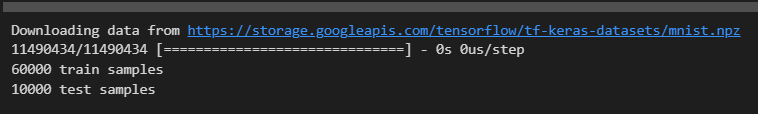
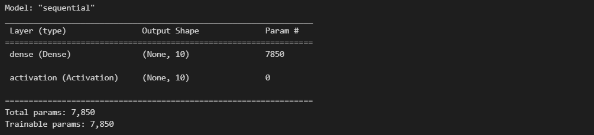
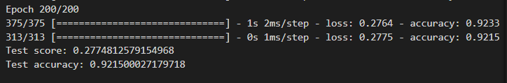

# Deep-Learning-With-Keras

# Setup

All .ipynb files can be executed in VSCode with python3 and `Jupyter Keymap` extension

additional dependencies

```bash
$ /bin/python3 -m pip install ipykernel numpy keras tensorflow -U --user --force-reinstall
```

# Simple Neural Network Sample

This python jupyter notebook creates a simple neural network with keras that will learn how to identify handwritten
numbers. I am giving it `60,000` handwritten samples from [MNIST](http://yann.lecun.com/exdb/mnist/) that are human annotated with the correct answer. The MNIST data is separated into a training set `X_train` and a testing set `X_test` to assess performance. The Input layer consiting of a neuron for each pixel in a sample image for a total of `28 x 28 = 784 neurons`. Neurons are normalized in a range of `[0,1]` which is the intensity of the pixel divided by `255`. There are a total of 10 possible outputs, digits `0-9`. The final layer is a single neuron that implements a softmax function that squashes k-dimensional vectors of arbitrary real values into a k-dimensional vector of `[0,1]`. Once the model is defined it is then compiled and trained `200` epochs before being evaluated for the final result.

## Load Data


## Define the Model


## Evaluate the Model

The results indicate that the baseline accuracy is `92.33%` on training, `92.32%` on validation, and `92.15%` on the test.